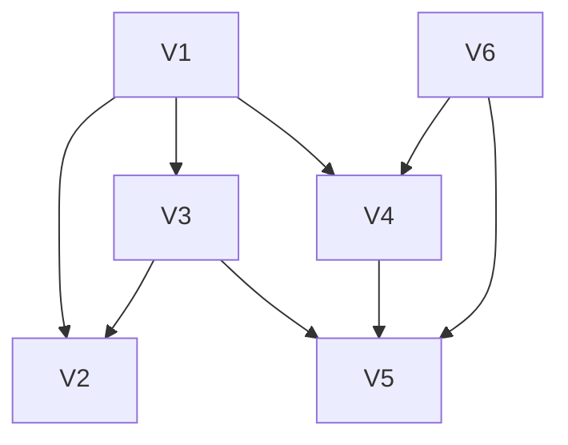
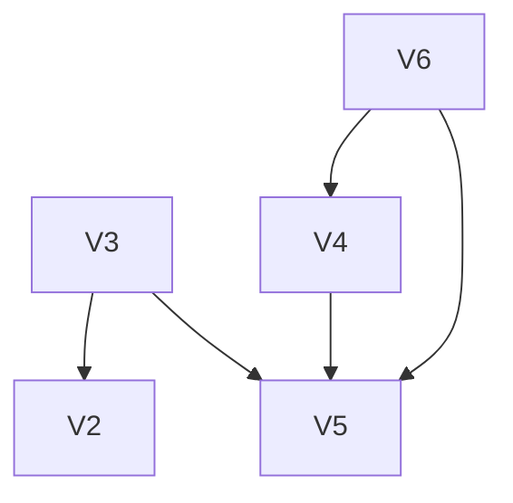
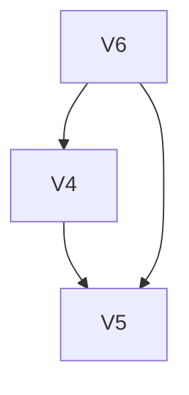
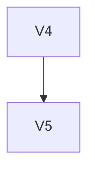

# 拓扑结构

## 拓扑排序 这样一种对图中顶点的排序方式

- 将图中的所有顶点排序，使得对于每一条有向边 u → v，顶点 u 都排在 v 之前。

- 拓扑排序 主要应用于 DAG（有向无环图）或 AOV 网，这种图没有环路，因此可以对其进行拓扑排序。

  - 首先需要区分 AOV 和 AOE 这两个概念，注意 拓扑排序 适用于 AOV，关键路径 适用于 AOE。

## AOV 网

- 用顶点表示活动，用弧表示活动间的优先关系的有向图称为用顶点表示 依赖关系 的网(Activity On Vertex Network)，AOV-网。
- 在AOV网中，任务或活动通常表示为顶点，而依赖关系（任务的先后顺序）表示为有向边。

## 拓扑排序

  1. 在有向图中选一个没有前驱的顶点且输出。
  2. 从图中删除该定点和所有以它为尾的弧。

- 例如对如下图的一条拓扑排序可以为

输出并删除符合标准的V1

输出并删除符合标准的V3

输出并删除符合标准的V6

依次输出V4, V5, 以及剩余的V2

得到拓扑排序为 V1 V3 V6 V4 V5 V2

- 此外，可以通过 DFS+栈 得到 拓扑序列，其步骤如下：

    对图进行深度优先遍历。
    每个节点 DFS 结束后将其压入栈中。
    最后将栈中元素逆序输出，就是 拓扑排序 结果。

## 拓扑排序的复杂度问题

- 拓扑排序 的时间复杂度通常为 O(V+E) ，其中 V 是顶点的数量， E 是边的数量。这个算法非常适合于解决任务调度和依赖关系问题，因为它可以确定任务的执行顺序或依赖关系的合理性。

- 关于拓扑排序，还需要关注以下几点：

    拓扑排序的结果 可能不唯一，因为在构建过程中往往会出现多个入度为 0 的顶点，不同的选择顺序会产生不同的合法排序结果。
    如果图中 存在环路，那么 无法进行拓扑排序，因为无法找到入度为 0 的顶点作为起始顶点。
